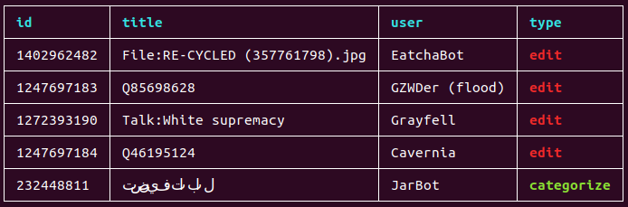

# Jtab

A tiny command line tool written in rust to print json data as a formatted table.

```bash
> echo '[{"id": "1", "name": "Rust"}, {"id": "2", "name": "Jtab"}]' | jtab

+----+------+
| id | name |
+----+------+
| 1  | Rust |
+----+------+
| 2  | Jtab |
+----+------+
```

## Install

- Linux and Macos binaries are available as tarballs in the [release section](https://github.com/wlezzar/jtab/releases/latest).
- For other platforms, you can use `cargo`:

```bash
cargo install --git https://github.com/wlezzar/jtab
```

## Sample commands

Pipe some weather data into jtab:

```bash
➜  ~ curl -s 'https://www.metaweather.com/api/location/search/?query=san' \
    | jtab

+-----------------------+---------------+------------------------+----------+
| latt_long             | location_type | title                  | woeid    |
+-----------------------+---------------+------------------------+----------+
| 37.777119, -122.41964 | City          | San Francisco          | 2487956  |
+-----------------------+---------------+------------------------+----------+
| 32.715691,-117.161720 | City          | San Diego              | 2487889  |
+-----------------------+---------------+------------------------+----------+
| 37.338581,-121.885567 | City          | San Jose               | 2488042  |
+-----------------------+---------------+------------------------+----------+
| 29.424580,-98.494614  | City          | San Antonio            | 2487796  |
+-----------------------+---------------+------------------------+----------+
| 36.974018,-122.030952 | City          | Santa Cruz             | 2488853  |
+-----------------------+---------------+------------------------+----------+
| -33.463039,-70.647942 | City          | Santiago               | 349859   |
+-----------------------+---------------+------------------------+----------+
```

Take only a subset of data and a subset of columns:

```bash
➜  ~ curl -s 'https://www.metaweather.com/api/location/search/?query=san' \
    | jtab --take 4 -f title -f woeid

+---------------+---------+
| title         | woeid   |
+---------------+---------+
| San Francisco | 2487956 |
+---------------+---------+
| San Diego     | 2487889 |
+---------------+---------+
| San Jose      | 2488042 |
+---------------+---------+
| San Antonio   | 2487796 |
+---------------+---------+
```

In the previous commands, `jtab` requires the full payload to be given to it at once as a valid json. To support use cases where data is piped in streaming mode, `jtab` supports a `--streaming` flag. The example below shows how you can ingest the wikipedia change stream in `jtab`:

```
➜  ~ curl -s  https://stream.wikimedia.org/v2/stream/recentchange \
    | grep data \
    | sed 's/^data: //g' \
    | jtab --streaming --take 5 -f id -f title -f user -f type

+------------+----------------------------------------------------------------------------------+-----------------+------------+
| id         | title                                                                            | user            | type       |
+------------+----------------------------------------------------------------------------------+-----------------+------------+
| 414757847  | Catégorie:Jeu de gestion sportive                                                | WikiSyn         | categorize |
+------------+----------------------------------------------------------------------------------+-----------------+------------+
| 1272227118 | Category:Infobox person using numbered parameter                                 | 103.119.242.116 | categorize |
+------------+----------------------------------------------------------------------------------+-----------------+------------+
| 106085139  | Dyskusja:Tadeusz Krzymowski                                                      | MastiBot        | new        |
+------------+----------------------------------------------------------------------------------+-----------------+------------+
| 1402697873 | File:Rajin harbour (30182522084).jpg                                             | EatchaBot       | edit       |
+------------+----------------------------------------------------------------------------------+-----------------+------------+
| 12149458   | Категория:Сандомир                                                               | NewsBots        | new        |
+------------+----------------------------------------------------------------------------------+-----------------+------------+
| 106085140  | Kategoria:Niezweryfikowane martwe linki niezarchiwizowane przez Internet Archive | MastiBot        | categorize |
+------------+----------------------------------------------------------------------------------+-----------------+------------+
```

You can conditionally colorize some fields based on their value:

```
➜  ~ curl -s  https://stream.wikimedia.org/v2/stream/recentchange \
         | grep data \
         | sed 's/^data: //g' \
         | jtab --streaming --take 5 -f id -f title -f user -f type \
                --colorize 'type:categorize:bFg' \
                --colorize 'type:edit:bFr'
```



The colorize string is in the format `column_name:value:style_spec`. The `style_spec` corresponds to [the style specifiers of the prettytable-rs](https://github.com/phsym/prettytable-rs#list-of-style-specifiers) library that jtab is based on.
